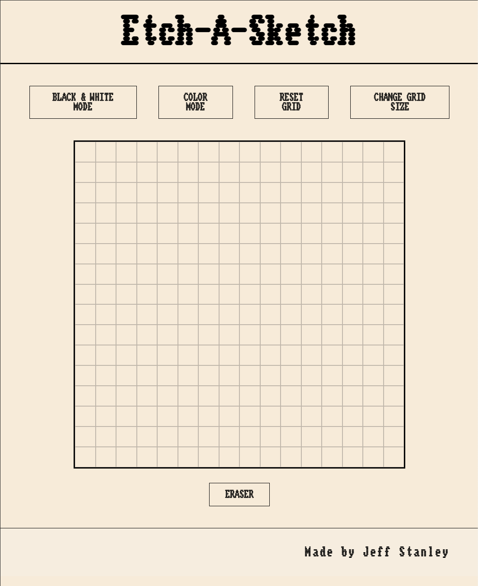

# Etch-A-Sketch!
Etch-A-Sketch aims to recreate the classic game with CSS, HTML and JS. The grid is generated with pure JS and styled with CSS.
<br>
<br>

## Screenshots



<br>
<br>

# Features
- Eraser mode
- Color mode
- Change grid size
- Black and white mode
<br>
<br>

## Lesson
I learned quite a bit making this. One of the most important lessons in particular though was learning how to make mistakes and learn in stride. 

I truly did not know where to start with this project but in a stroke of luck while cooking I knew I could create the grid with HTML by nesting `<cell>` elements within a parent element `<row>` as pictured below as a 2 x 2 grid:

```
<grid-container>
    <row>
        <cell></cell>
        <cell></cell>
    </row>
    <row>
        <cell></cell>
        <cell></cell>
    </row>
</grid-container>
```

After that, the project starting falling into place and finally culminated in a complete recode from the ground up!

## Author
 Jeff Stanley -- 2024